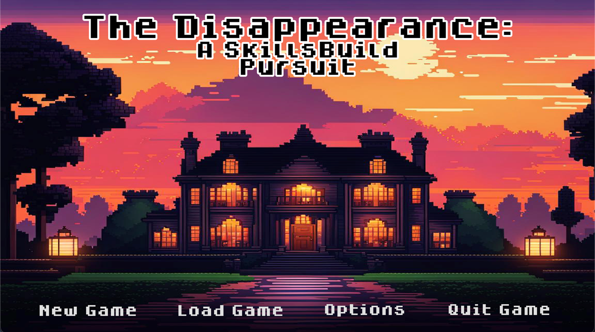
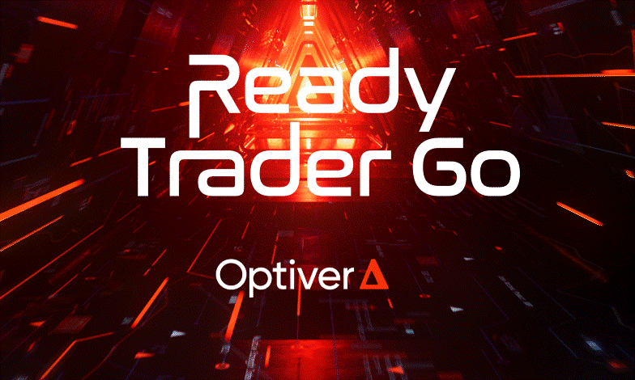

<h1 align="center">
    
</h1>

 
 🔭 I’m currently working on **an RPG Pixel Game**
 
 🌱 I’m currently learning **GDScript and Haskell**

💬 Ask me about **Excel Automation**

⚡ Fun fact: **The fear of long words is called Hippopotomonstrosesquippedaliophobia**

 
  
  

 
 
I am on a mission to become a versatile master of Computer Science, with a keen interest in data science and machine learning, I aspire to empower companies with artificial intelligence in the future.

Feel free to explore my repositories to see my learning process in action. Each project reflects my journey of growth and exploration in the world of computer science. From initial experiments to polished solutions, you'll witness firsthand how I tackle challenges and expand my skills.

---

<h2 align="center"> 📜Languages and Tools⚒️</h2>

  <h3 align="center">Languages</h3>
  
  
  
  
  
  
  
  

  
  

  <h3 align="center">Tools</h3>
  
  
  
  
  
  

 
 

<h2 align="center">⭐ Highlighted Projects & Repos ⭐</h2>
 

  

    <h3>Software Engineering</h3>
    

        <a href="https://djp200304.itch.io/the-disappearance-an-ibm-skillsbuild-pursuit" target="_blank"><h4>The Disappearance: An IBM Skillsbuild Pursuit</h4></a>
        </img>
        
 🎲 This role-playing game (RPG) is designed to be used alongside IBMs SkillsBuild courses  🎲 SkillsBuild is an online platform aimed towards college/undergraduate students to allow them to build theirunderstanding of a variety of technology topics and earn digital credentials while doing so.  🎲 Unfortunately the repository cannot be pushed into the public domain yet. But the link will take you to play the game. Have a look :)
        

        <h5>Platform: </h5> Godot
        <h5>Language: </h5> GDscript  
    

    
  

  

    <h3>Data Science</h3>
    

      <a href="https://github.com/DenisPiralic/OptiverTrader" target="_blank"><h4>Optiver: Ready Trader Go!</h4></a>
        </img>
        
 📈Ready Trader Go is a student coding competition that dives into the world of algorithmic trading. 📈<a href="https://github.com/adamSeidel" target="_blank">Adam</a> and I researched and encorporated pixel strand trading and managed to code it successfully in Python, with a large simulated profit 📈 More information in the LogBook UserManual !
        
 
        <h5>Language: </h5> Python, JupyterNotebook
        <h5>Tools: </h5> Pandas, NumPy
    

  

 
 

<h2 align="center">⚡ Stats ⚡</h2>
 

  
   
  

  

              
